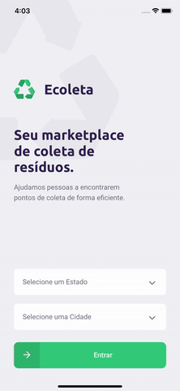

<p align="center">

</p>

<h1 align="center">Welcome to Ecoleta Web 👋</h1>

<p align="center">
 Projeto desenvolvido durante a Next Level Week da Rocketseat.
</p>

## Demo
<h1 align='center'>
    
</h1>

## Índice

- [Demo](#demo)
- [Índice](#índice)
- [🚀 Sobre a aplicação](#-sobre-a-aplicação)
- [🚀 Tecnologias utilizadas](#-tecnologias-utilizadas)
- [🗂 Como baixar o projeto](#-como-baixar-o-projeto)

## 🚀 Sobre a aplicação

- Essa aplicação será um Aplicativo para Encontrar pontos de coleta mais próximos. Podendo filtrar por Estado e Cidade além de qual tipo de item será coletado.
- A aplicação foi feita usando Expo, Typescript, e a lib axios para conexão com a fake api.

## 🚀 Tecnologias utilizadas

O projeto foi desenvolvido utilizando as seguintes tecnologias:

- [Expo](https://expo.io)
- [Typescript](https://www.typescriptlang.org/)
- [expo-google-fonts](https://github.com/expo/google-fonts)
- [react-native-picker-select](https://github.com/lawnstarter/react-native-picker-select#readme)
- [React Navigation](https://reactnavigation.org)
- [Styled-Components](https://styled-components.com/)
- [ESLint](https://eslint.org)
- [Prettier](https://prettier.io)
- [Axios](https://github.com/axios/axios)

## 🗂 Como baixar o projeto

```bash

    # Clonar o repositório
    $ git clone https://github.com/mnzsss/ecoleta-app.git

    # Entrar no diretório
    $ cd ecoleta-app

    # Instalar as dependências
    $ yarn

    # Clonar o Servidor
    $ git clone https://github.com/mnzsss/ecoleta-api.git

    # Iniciar o servidor
    $ yarn dev:server

    # Iniciar o projeto
    $ cd ../ecoleta-app
    $ yarn start

    # Irá abrir o console do Expo
    # Lá você poderá rodar um Emulador Android ou IOS
```

---

<p align="center">
  Criado com ❤️ por Gabriel Menezes
</p>
